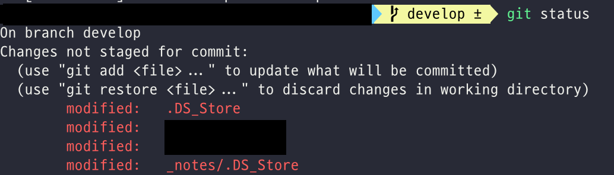
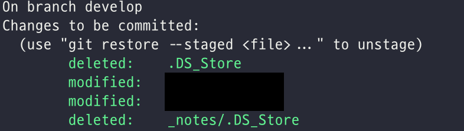

작업을 하다보면, OS나 Language 특성으로 자동 생성되는 파일이 있다.
그리고 이런 파일들은 보통 git으로 추적할 필요가 없는데, 이를 설정해주는 파일이 `.gitignore` 이다.
이 파일에 등록하여 추적하기 싫은 파일명을 등록했는데도, git에서 추적되는 경우가 있다.. 이를 해결하는 방법이며, 요약하면 아래와 같다!
``` shell
git rm -r --cached .
```


## 이슈
추적할 필요가 없는 [.DS_Store](https://en.wikipedia.org/wiki/.DS_Store) 를 제외해보려고 했다.
	
	
이를 제거하려고 .gitignore를 생성하여 저 파일을 대상으로 포함시켰다.
[gitignore](https://www.toptal.com/developers/gitignore)

그런데도.. **git status를 해보면, 여전히 추적되고 있는 파일을 확인할 수 있었고..** 이는 아래와 같이 해결했다.


## 해결방법
1. 다시 한 번 .gitignore 파일을 점검한다. 제외하고 싶은 대상이 작성되어 있는지 확인한다. 
2. 커밋하기 싫은 대상을 제외하고, 커밋하고 싶은 대상만 모두 commit 한다.
3. 다음 명령어를 입력해서 **캐쉬를 초기화**한다. (**문제해결을 위한 key다.**)
	```shell
	git rm -r --cached .
	```
4. git status를 입력해서, 커밋하기 싫은 대상이 제거되었는지 확인한다.
	```shell
	git status
	```


5. 다시 아래 명령어를 입력해서 stage에 파일을 올리고 commit한다.
	``` shell
	git add .
	git commit -m "reset cache and fix tracking issue" 
	```

_끝_